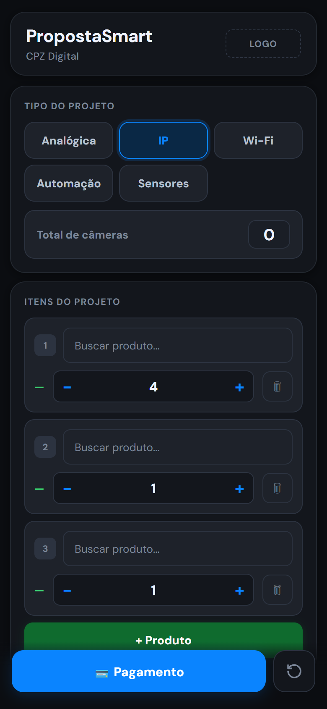
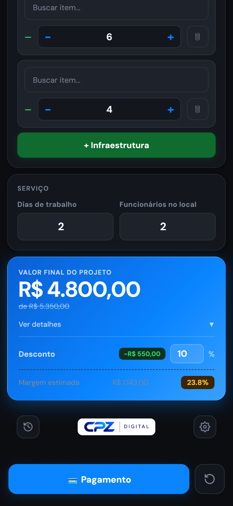
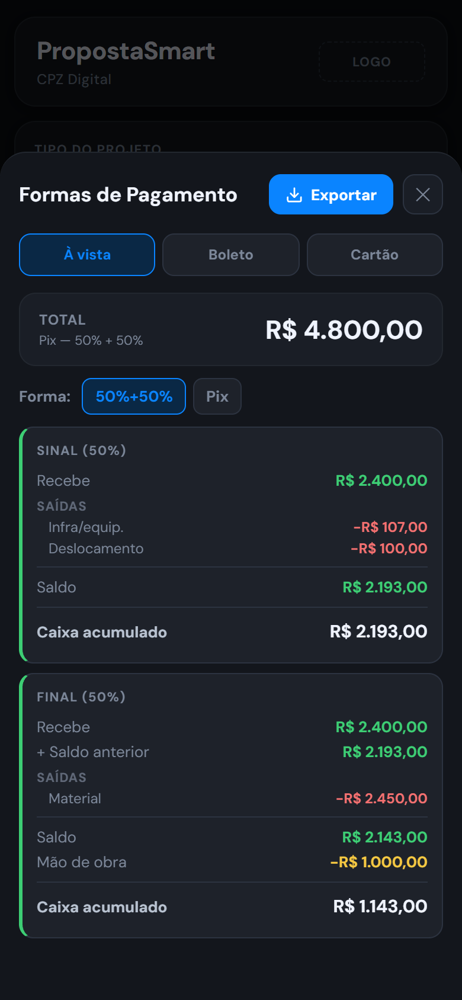
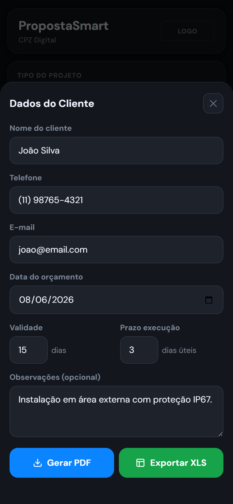
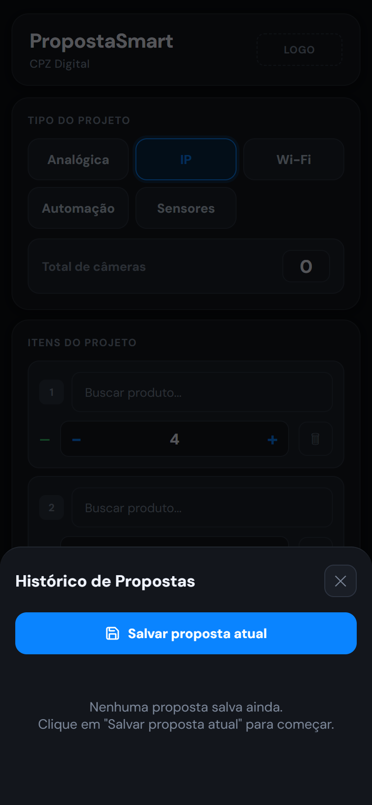

<div align="center">


# PropostaSmart

**Gere propostas profissionais de segurança eletrônica em segundos.**

Direto no celular. Sem instalação. Com histórico em nuvem e sincronização de equipe.

<br>

[](https://adrianpz.github.io/propostasmart-cpz/)
[](#)
[](#)
[](https://adrianpz.github.io/propostasmart-cpz/)

<br>

[**→ Acessar o app**](https://adrianpz.github.io/propostasmart-cpz/)

</div>

---

## 📱 Veja o app em ação

<div align="center">

<table>
<tr>
<td align="center" width="20%">
<br>
<sub><b>Tela principal</b></sub>
</td>
<td align="center" width="20%">
<br>
<sub><b>Resultado e margem</b></sub>
</td>
<td align="center" width="20%">
<br>
<sub><b>Fluxo de caixa</b></sub>
</td>
<td align="center" width="20%">
<br>
<sub><b>Dados do cliente</b></sub>
</td>
<td align="center" width="20%">
<br>
<sub><b>Histórico</b></sub>
</td>
</tr>
</table>

</div>

---

## O problema que resolvemos

Vendedores de segurança eletrônica perdem tempo calculando orçamentos na mão, em planilhas desorganizadas ou usando papel. O resultado: propostas inconsistentes, erros de precificação e oportunidades perdidas.

**O PropostaSmart resolve isso.**

---

## ✨ O que você ganha

<table>
<tr>
<td width="50%">

### 📄 Propostas profissionais
Gere PDF e Excel com visual profissional em segundos — dados do cliente, relação de materiais, tabela de pagamento, cláusula de aceite e assinaturas.

</td>
<td width="50%">

### 💰 Precificação automática
Multiplicadores configuráveis por tipo de projeto (analógica, IP, Wi-Fi, automação) e dificuldade. Nunca mais venda abaixo do custo.

</td>
</tr>
<tr>
<td>

### 📊 Análise de viabilidade
Simula o fluxo de caixa para cada forma de pagamento (Pix, boleto, cartão) e alerta quando uma opção deixa o caixa negativo.

</td>
<td>

### 🕐 Histórico em nuvem
Salve propostas na nuvem e acesse de qualquer dispositivo. Toda a equipe vê o histórico em tempo real, com o nome do vendedor que criou cada proposta.

</td>
</tr>
<tr>
<td>

### 📱 Instala como app
PWA instalável no celular sem passar pela App Store ou Play Store. Funciona offline após a configuração inicial.

</td>
<td>

### 🔄 Preços sempre atualizados
Conecte sua planilha Google Sheets. O app detecta automaticamente quando os preços mudam e notifica para atualizar.

</td>
</tr>
</table>

---

## 🖥️ Funcionalidades

| Funcionalidade | Descrição |
|---|---|
| **Banco de dados próprio** | Planilha Google Sheets ou CSV local com seus produtos e preços |
| **Busca inteligente** | Encontra produtos por nome ou código em tempo real |
| **Tipos de projeto** | Analógica, IP, Wi-Fi, Automação, Sensores |
| **Calculadora CFTV** | Estimativa de armazenamento por resolução e dias de retenção |
| **Margem estimada** | Exibe margem bruta e lucro em tempo real — invisível no PDF |
| **Desconto flexível** | Até 50%, com arredondamento inteligente e indicador de economia |
| **Observações no PDF** | Campo livre para condições especiais, escopo excluído, avisos |
| **WhatsApp integrado** | Botão direto para enviar o PDF ao cliente pelo WhatsApp |
| **Multi-empresa** | Cada empresa tem seu código de convite; vendedores compartilham histórico |
| **Tema claro/escuro** | Adapta automaticamente ao sistema do dispositivo |

---

## 🚀 Como funciona

```
1. Acesse o app → Abra as Configurações (⚙️)
2. Crie sua conta e empresa (receba seu código de equipe)
3. Conecte sua planilha de produtos
4. Monte o orçamento → ajuste tipo, produtos, serviço e desconto
5. Gere o PDF → compartilhe pelo WhatsApp
```

---

## 👥 Para equipes

Cada empresa recebe um **código de 6 caracteres**. Basta compartilhá-lo com os vendedores — todos fazem login e passam a ver o mesmo histórico de propostas, sincronizado em tempo real na nuvem.

```
Criador da empresa  →  recebe o código ABC123
Vendedor 1          →  entra com o código ABC123
Vendedor 2          →  entra com o código ABC123
                        ↓
              Histórico compartilhado entre todos
```

---

## 📋 Formato das planilhas

### Produtos
| Coluna | Conteúdo | Exemplo |
|--------|----------|---------|
| A | Código | `CAM-001` |
| B | Nome | `Câmera Bullet 2MP Full HD` |
| C | Valor unitário (R$) | `150.00` |

**Prefixos reconhecidos:** `CAM-` · `DVR` · `NVR` · `ARM-` · `CAB-` · `INF-` · `SW` · `RED-` · `ENG-` · `AUT-`

### Infraestrutura
| Coluna | Conteúdo | Exemplo |
|--------|----------|---------|
| A | Nome do item | `Eletroduto 3/4" 3m` |
| B | Valor unitário (R$) | `12.50` |

> Baixe os arquivos de exemplo diretamente no app em **⚙️ Configurações → Banco de dados → Exemplo**.

---

## 🛠️ Tecnologias

| | |
|---|---|
| **Frontend** | HTML · CSS · JavaScript puro (sem frameworks) |
| **PDF** | html2pdf.js |
| **Excel** | ExcelJS |
| **Backend / Auth** | Supabase (PostgreSQL + Row Level Security) |
| **Hospedagem** | GitHub Pages |
| **Offline** | PWA + Service Worker |

---

<div align="center">

**Desenvolvido por [CPZ Digital](https://cpzdigital.com.br)**

*Soluções em tecnologia para o setor de segurança eletrônica*

</div>
